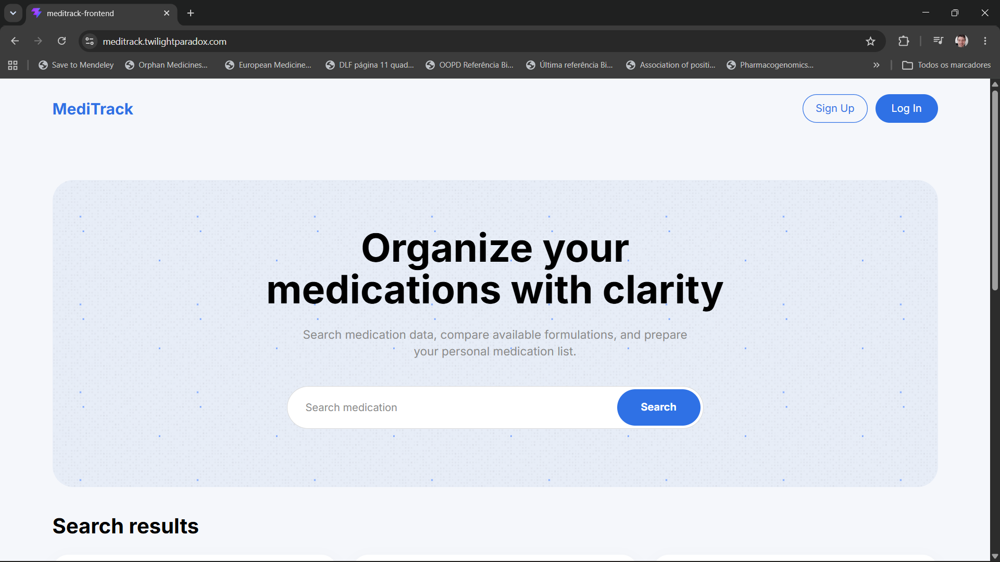
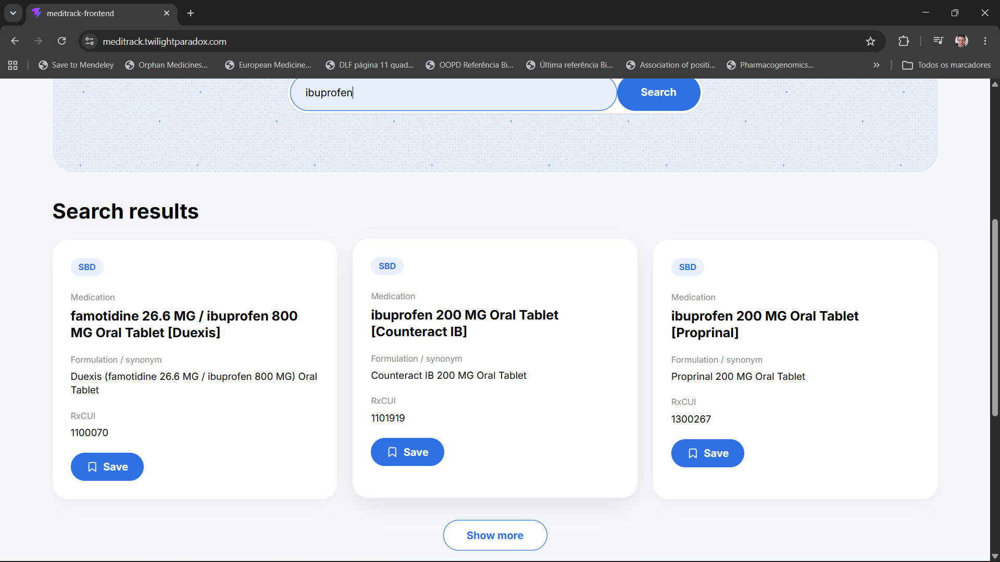
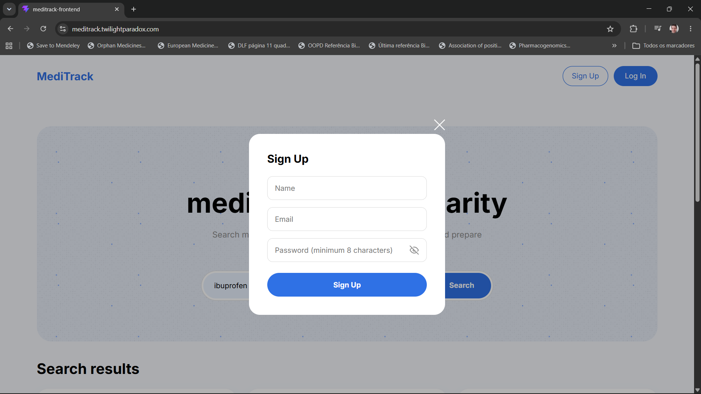
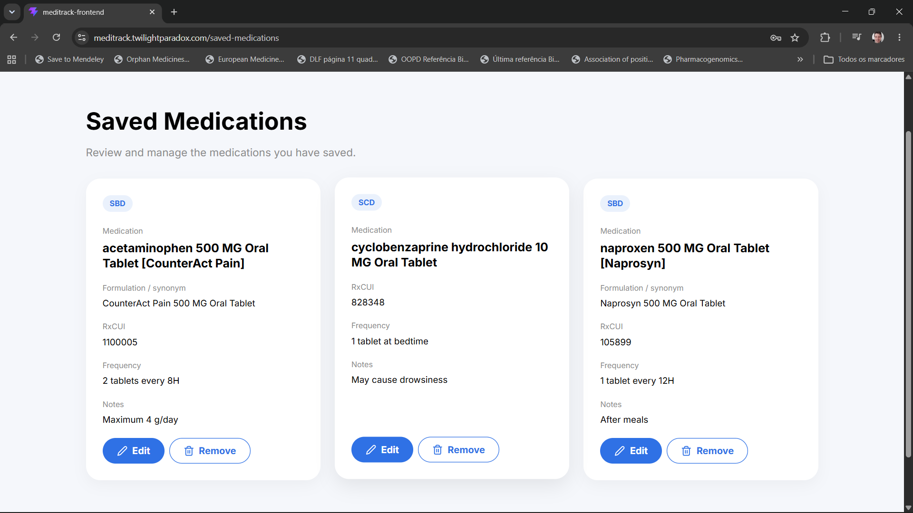
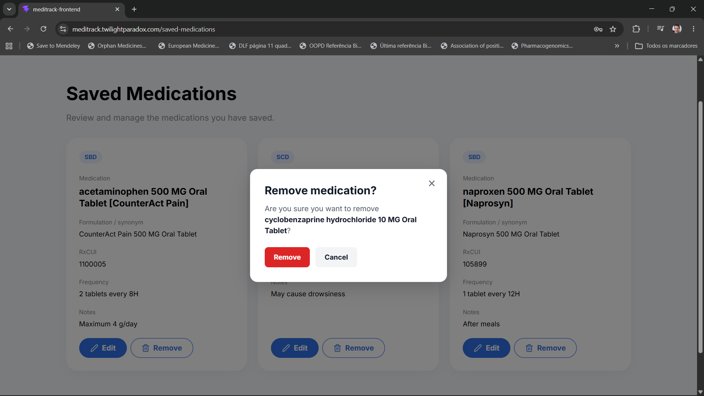
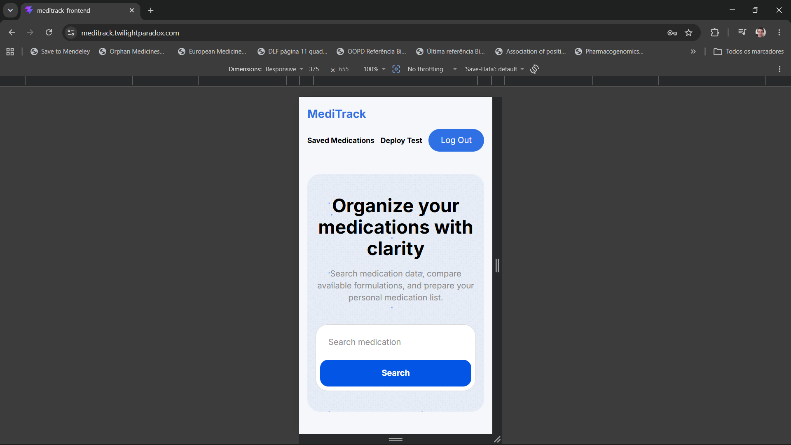

# MediTrack

A full-stack medication search and management application built with React, Node.js, Express, MongoDB, and the RxNorm API.

MediTrack allows users to search medication data, create an account, save medications to a personal list, and add custom notes or frequency instructions.

🌐 **Live Demo:** https://meditrack.twilightparadox.com
⚙️ **Backend Repository:** https://github.com/p3drofaustino-lang/meditrack-backend

This project was developed as the final project for the TripleTen Web Development program.

## Highlights

* Full-stack application built with React and Express
* RxNorm API integration for medication search
* JWT authentication and protected routes
* MongoDB database integration
* CRUD functionality for saved medications
* Duplicate medication prevention per user
* Google Cloud deployment with Nginx
* Responsive layout for desktop, tablet, and mobile

## Screenshots

### Home Page



### Medication Search Results



### Register Modal



### Saved Medications



### Delete Confirmation



### Mobile View



## Features

* Search medications by name or active ingredient
* Display structured medication results from the RxNorm API
* Show initial results with a "Show more" option
* Register and log in with a personal account
* Toggle password visibility in authentication forms
* Save medication search results to a personal account
* View saved medications on a protected page
* Add and edit medication notes and frequency instructions
* Remove saved medications with a confirmation modal
* Prevent duplicate saved medications
* Display action feedback messages for save, edit, remove, and duplicate states
* Use protected routes for authenticated users
* Responsive layout for desktop, tablet, and mobile
* Clean UI with accessible text labels and action icons

## Technologies

### Frontend

* React
* Vite
* JavaScript (ES6+)
* CSS3
* React Router
* React Icons
* localStorage

### Backend

* Node.js
* Express.js
* MongoDB
* Mongoose
* JWT Authentication

### APIs

* RxNorm REST API
* Custom REST API

### Deployment

* Google Cloud Platform
* Nginx
* HTTPS
* Custom domain

## Architecture

```txt
React Frontend
      │
      ▼
Custom REST API
      │
      ▼
Express Backend
      │
      ▼
MongoDB Database

RxNorm API
      ▲
      │
Medication Search
```

## External API

MediTrack uses the RxNorm API to retrieve medication data.

Example request:

```txt
https://rxnav.nlm.nih.gov/REST/drugs.json?name=ibuprofen
```

## Backend API

This frontend connects to a custom Express and MongoDB backend API.

The backend handles:

* User registration
* User login
* JWT authentication
* Saved medications
* Medication editing
* Medication deletion
* Duplicate medication prevention per user

Backend repository:

```txt
https://github.com/p3drofaustino-lang/meditrack-backend
```

## Installation

Clone the repository:

```bash
git clone git@github.com:p3drofaustino-lang/meditrack-frontend.git
```

Navigate to the project folder:

```bash
cd meditrack-frontend
```

Install dependencies:

```bash
npm install
```

Run the development server:

```bash
npm run dev
```

Build the project:

```bash
npm run build
```

## Development Setup

Live site:

```txt
https://meditrack.twilightparadox.com
```

Backend API:

```txt
https://api.meditrack.twilightparadox.com
```

Backend repository:

```txt
https://github.com/p3drofaustino-lang/meditrack-backend
```

## Main Routes

```txt
/                    Home page and medication search
/saved-medications   Protected saved medications page
```

## Project Structure

```txt
src/
  components/
    App/
    Header/
    Main/
    MedicationCard/
    MedicationList/
    SavedMedications/
    LoginModal/
    RegisterModal/
    ProtectedRoute/
  contexts/
  utils/
```

## Project Status

Core frontend functionality is complete:

* Medication search
* Authentication flow
* Protected saved medications page
* Save, edit, and remove medication actions
* Duplicate prevention feedback
* Delete confirmation modal
* Password visibility toggle
* Responsive layout
* Production deployment

## Future Improvements

* Export saved medication lists
* Share medication lists
* Add medication reminders
* Improve accessibility details
* Add language support for Portuguese and Spanish
* Add more detailed medication information where available

## Author

Pedro Faustino

* GitHub: https://github.com/p3drofaustino-lang
* LinkedIn: Add your LinkedIn URL here
